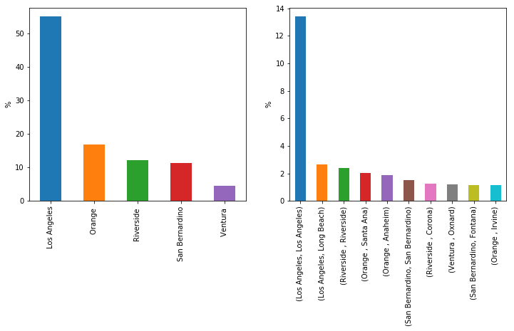

# Environmental Analysis of the Greater Los Angeles Area

## Introduction

The Greater Los Angeles Area has a reputation for having one of the
worst air pollution in the country. This is a big concern for the
large population that live in these area due to its health
consequences. Diseases such as Asthma, respiratory infections, lung
cancer, and other cardiovascular ones are known to be caused to
the exposure to poor air quality.

However, what are the causes for having such a poor air quality? is
the problem related to the high number of freeways and volume of
traffic? what are the areas that impacted the most by the pollution?
are there any socioeconomic factors related?

Fortunately, the [Office of Environmental Health Hazard Assessment
(OEHHA)](https://oehha.ca.gov/) has collected an extensive dataset
with includes exposure indicators, environmental effects, and
socioeconomic indicators with the purpose of identifying and adjusting
policies for the communities burdened by pollution in the state of
California. This dataset can help us answer specific questions related
to Los Angeles. Let's start describing general information about the
metro and its population.

## Population Distribution

<div style="text-align:center">
<iframe src="https://www.google.com/maps/d/embed?mid=1FL3R-M6FCh59L4mwaEM4UnM1-ATXDnUu" width="500" height="300"></iframe>
</div>


The Greater Los Angeles Area is one of the fastest-growing regions in
the US, that contains five counties in Southern California: Los
Angeles, Orange, Riverside, San Bernardino, and Ventura. Based on the
OEHHA dataset, its total population is 17,876,950. Of the total, 55%
people are in Los Angeles county, 17% of people in Orange County, 12%
of people in Riverside, 11% of people in San Bernardino, and 5% in the
county of Ventura.

<div style="text-align:center">

</div>

Additionally, the most populated city in the area is Los Angeles (LA
county) with almost 13.4% of the total population, followed by Long
Beach, Riverside and Santa Ana with 2%-2.6%. The top ten closes with
Fontana and Irvine each with 1.1% of the population. 


## Pollution Burden

The OEHHA uses the pollution burden as a metric that represents the
potential exposure of the population to pollutants and negative
environmental conditions caused by pollution. The exposure indicators
available in the data set are the following.

- Air quality - Ozone
- Air quality - PM2.5
- Diesel particulate matter
- Drinking water contaminants
- Pesticide use
- Toxic releases from facilities
- Traffic density

The environmental effects indicators considered are:

- Cleanup sites
- Groundwater threats
- Hazardous waste generator and facilities
- Impaired water bodies
- Solid waste sites and facilities

The OEHHA uses these data to calculate a pollution burden score that
aims at identifying the most vulnerable communities to pollution. For
instance, the data shows the following correlations. 

```
$ corr.pollution_burden[(corr.pollution_burden.abs() >= 0.3)]

census_tract                         -0.320060
zip                                  -0.396460
ces_30_score                          0.680900
pm25                                  0.630846
diesel_pm                             0.469542
traffic                               0.446796
cleanup_sites                         0.515450
groundwater_threats                   0.422746
haz_waste                             0.355236
solid_waste                           0.393173
pollution_burden                      1.000000
pollution_burden_score                0.999998
education                             0.314931
linguistic_isolation                  0.337100
california_county_Los Angeles         0.310406
sb_535_disadvantaged_community_No    -0.548386
sb_535_disadvantaged_community_Yes    0.548386
Name: pollution_burden, dtype: float64

```

Interestingly, the pollution burden has a moderate correlation with
the Los Angeles county. In addition, it moderately correlates to
environmental exposure factors such as `diesel_pm`, hazard waste and
socioeconomic factors such as education levels. The ZIP code has a
negative moderate correlation, as well. The pollution burden strongly
correlates with the pm2.5 factor that measures the quality of the air
and the location of cleanup sites. Since the ces3.0 score is a measure
of the pollution burden, and the status of a disadvantaged community
it is determined by its pollution burden, it is expected this high
correlation.


## Pollution Burden Location Distribution

The correlation indicates that the ZIP code and whether the data was
collected in the Los Angeles county has an impact on the pollution
burden. The following map shows the ZIP codes of the top and bottom 1%
pollution burden values.


<div style="text-align:center">
<iframe src="https://www.google.com/maps/d/embed?mid=1cdEoosv1ejLW9oLYWoUKG0tyxDzeEjh4" width="500" height="300"></iframe>
</div>


The map shows that the areas with the lowest burden are away from the
center of Los Angeles city. They are considered rural areas in the
Greater Los Angeles Area. On the other hand, the areas belonging to
the highest burden are close to the center of Los Angeles and
generally close to industrial areas or main freeways.


<div style="text-align:center">


</div>


The data shows that both the lowest and highest burdened communities
are located in Los Angeles county. Part of this is due to the fact
that more than 50% of the total population is located in this
county. Therefore, more traffic, factories, and activities occur in
this county. We also see that both the lowest and highest burdened
communities have high levels of poverty. Which can be explained with
the fact that the lowest burdened communities are located in rural and
desertic areas that do not have access to a lot of resources. On the
other hand, industrial areas dominated by factories and close to big
freeways are usually less attractive in the real state market, and
usually more affordable for people with less economic resources.


## Poverty Distribution


<div style="text-align:center">
<iframe src="https://www.google.com/maps/d/embed?mid=1j-ERPIwrCVyhwzsRRUcV9NbPahqSgFBA" width="500" height="300"></iframe>
</div>


Consider now the poverty distribution. The map shows the the ZIP codes
with the lowest poverty values are usually located on areas that are
considered affluent. Several of these areas are close to the ocean and
on hills. In the case of the poorest ZIP codes, they are located in a
mixture of rural and central areas. 


<div style="text-align:center">


</div>


The data shows that Orange county has around 40% of the wealthiest
population, followed by a 25% in Los Angeles county. We also note that
most of the wealthiest ZIP codes have mid range pollution burden
between 20 to 40, with a few going above 50. In the case of the
poorest areas, 80% of this population is in Los Angeles county and the
other 20% is in San Bernardino. The pollution burden for these case
remains above 40 with a few reaching values close to 80.


## Conclusions

This report shows a few of the factors that influence the pollution
burden that the population of the Greater Los Angeles Area is subject
to.

- The pollution burden of a community is an important piece of
  information that the authorities should use to establish policies
  that benefit the population. For instance, communities with higher
  pollution burden can benefit of tax benefits for air and water
  filter. Also, environmental organization can launch campaigns that
  can help the community understand the risk of being exposed to
  pollution and promote for alternatives that can help reduce them.

- The least affected communities are usually isolated areas located
  far away from the main commercial areas in Los Angeles. Some of
  these areas have high levels of poverty due to a lack of availability
  of resources.

- Los Angeles County has both the areas with the highest poverty and
  pollution burden. Some of these areas overlap, and it is due to the
  fact that affordable housing is usually available in more vulnerable
  areas.
